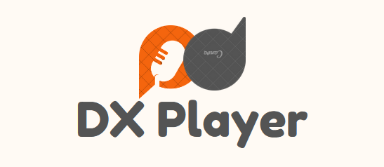
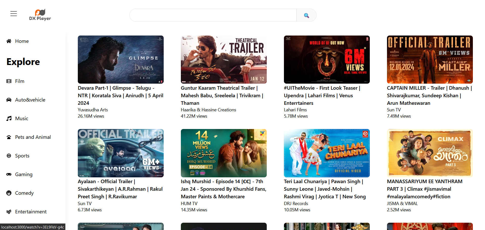
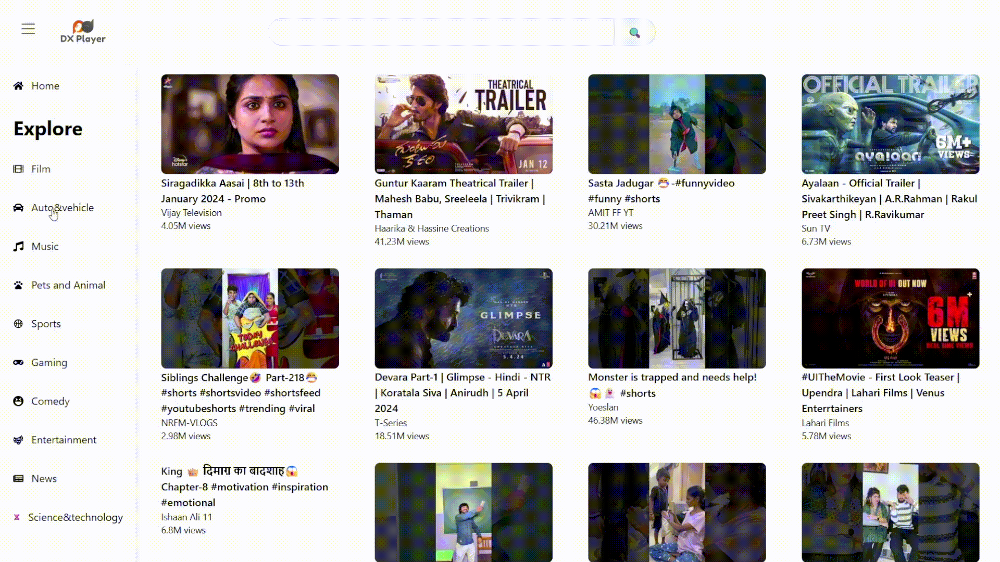

<h1 align="center">
  <br>
  <a href="https://dxplayer.netlify.app/"></a>
  <br>
  <br>
  <b>DX Player</b>
  <br>
</h1>

> An Online Video Player created with React and Youtube API



## How to setup locally

### Clone

Clone the repo to your local machine using `https://github.com/Divyansh-P/DxPlayer`

### Setup

Install npm dependencies

```js
 npm install
```

Create a `.env` file

Set up the following environment variables

```js
VITE_YTAPI_KEY // From Youtube 
VITE_AUTOSUGGESTAPI_KEY // From Rapidapi Youtubedata API
```
Finally, run <code>npm start</code>

## Screenshots

### Videos based on specific categories



### Search functionality with autosuggestions


### Watch video with realated video suggestions

